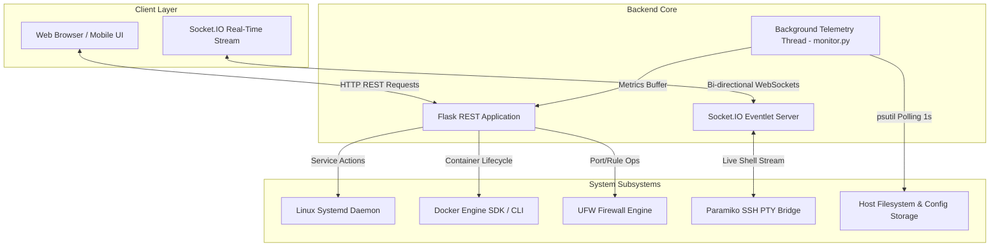

# ⚡ Python Service Manager & Linux Infrastructure Control Plane

<p align="center">
  
</p>

<p align="center">
  <strong>An enterprise-grade, lightweight web-based Linux system administration, microservice orchestration, Docker container management, and real-time infrastructure telemetry platform built with Flask, Socket.IO, Systemd, and Paramiko.</strong>
</p>

<p align="center">
  <a href="https://github.com/ShriyashBPatil/python-service-manager/stargazers"></a>
  <a href="https://github.com/ShriyashBPatil/python-service-manager/network/members"></a>
  
  
  
  
  
  
</p>

---

## 📑 Table of Contents

- [Overview](#-overview)
- [System Architecture](#-system-architecture)
- [Key Features](#-key-features)
  - [1. Real-Time Telemetry & Hardware Monitoring](#1-real-time-telemetry--hardware-monitoring)
  - [2. Microservice & Systemd Unit Orchestration](#2-microservice--systemd-unit-orchestration)
  - [3. Docker Container & Stack Management](#3-docker-container--stack-management)
  - [4. UFW Firewall & Port Diagnostic Suite](#4-ufw-firewall--port-diagnostic-suite)
  - [5. Interactive Web SSH & Pseudo-Terminal (PTY)](#5-interactive-web-ssh--pseudo-terminal-pty)
  - [6. Directory Explorer Modal & Import Wizard](#6-directory-explorer-modal--import-wizard)
  - [7. AI Copilot Integration (AIC)](#7-ai-copilot-integration-aic)
- [Directory & File Structure](#-directory--file-structure)
- [REST API & WebSocket Specification](#-rest-api--websocket-specification)
- [Configuration Guide](#-configuration-guide)
- [Installation & Quickstart](#-installation--quickstart)
- [Production Deployment (Systemd & Nginx)](#-production-deployment-systemd--nginx)
- [Troubleshooting & FAQs](#-troubleshooting--faqs)
- [Contributing](#-contributing)
- [Author & License](#-author--license)

---

## 🌟 Overview

Running modern microservices, background Python workers, Node.js daemons, and Docker stacks across multiple Linux servers typically requires juggling command-line tools like `systemctl`, `journalctl`, `docker-compose`, `ufw`, `top`, and `netstat`.

**Python Service Manager** consolidates all of these mission-critical server administration tasks into an elegant, high-performance web dashboard. Designed with zero heavy external dependencies, it operates directly on top of native Linux subsystems to provide real-time control, live telemetry graphs, interactive terminal sessions, container lifecycle workflows, and instant automated service generation.

---

## 🏗 System Architecture



---

## 🚀 Key Features

### 1. Real-Time Telemetry & Hardware Monitoring
- **Live Performance Counters**: Continuous 1-second interval sampling of CPU load (per-core and global), RAM utilization, Swap memory, root and mounted disk partitions, and live network I/O traffic.
- **Historical Metrics Ring Buffer**: In-memory rolling telemetry buffer providing smooth SVG/Canvas line graphs displaying CPU and Memory utilization trends over time.
- **Top Resource Processes**: Instant visibility into top memory- and CPU-consuming server processes with PID, user, memory percentage, and command lines.

### 2. Microservice & Systemd Unit Orchestration
- **Automated `.service` Generation**: Easily define custom Python applications, specifying execution binaries, custom virtual environments (`/venv/bin/python`), working directories, environment variables (`KEY=VAL`), running users, and restart policies (`always`, `on-failure`, `no`).
- **Full Lifecycle Control**: Start, Stop, Restart, Enable (autostart on boot), Disable, and Delete services with instant visual status updates.
- **Live Journalctl Log Streaming**: High-throughput log viewer with automatic ANSI color code parsing, auto-scrolling, search filtering, and line limits.
- **Systemd Service Discovery & Import**: Automatic scanning and discovery of existing system-level services on `/etc/systemd/system` and `/lib/systemd/system` to import unmanaged services into the control panel.

### 3. Docker Container & Stack Management
- **Container Lifecycle**: Inspect, Start, Stop, Restart, Pause, Unpause, and Force-Kill running or stopped Docker containers.
- **Container Telemetry & Log Inspection**: Real-time container-level CPU/Memory consumption and live `docker logs` streaming.
- **Image Operations**: Pull new images from Docker Hub, inspect image layers and environment variables, remove dangling images, and trigger system-wide prune commands.
- **Compose Stack Awareness**: Grouped container view showing linked multi-container application stacks.

### 4. UFW Firewall & Port Diagnostic Suite
- **Rule Management**: List active UFW firewall rules, open ports (TCP/UDP), delete existing rules, and enable/disable the global firewall state.
- **Interactive Port Scanner**: Live diagnostic tool to check whether specific internal or external ports (e.g., 80, 443, 3306, 5000, 8080) are listening, closed, or filtered.

### 5. Interactive Web SSH & Pseudo-Terminal (PTY)
- Full-featured, xterm-compatible in-browser terminal session.
- Powered by `paramiko` SSH client and WebSocket channels, supporting ANSI escape sequences, tab-completion, curses-based applications (`htop`, `nano`, `vim`), and window resizing (`TIOCSWINSZ`).

### 6. Directory Explorer Modal & Import Wizard
- Built-in visual server directory picker modal for selecting script entrypoints, configuration directories, and virtual environments without manual path typing.

### 7. AI Copilot Integration (AIC)
- API endpoint integration allowing external AI coding companions and assistants to query live server overview, health metrics, and running services securely.

---

## 📂 Directory & File Structure

```
python-service-manager/
├── app.py                   # Main Flask HTTP routing, socket handlers & auth gates
├── config.py                # File-backed JSON settings & service catalog persistence
├── monitor.py               # Background daemon thread capturing psutil metrics
├── service_manager.py       # Custom service catalog manager & systemd generation
├── systemd.py               # Systemd subprocess commands & journalctl stream parser
├── docker_manager.py        # Docker Engine SDK wrapper and CLI container bindings
├── firewall_manager.py      # UFW rules parser, rule modifier, and port manager
├── utils.py                 # System info extractors, port checks & filesystem browser
├── requirements.txt         # Pinned Python package dependencies
├── services.example.json    # Initial service catalog configuration blueprint
├── settings.example.json    # Initial application settings blueprint
├── static/                  # Static web assets
│   ├── css/
│   │   └── style.css        # Clean responsive styles with dark/light themes
│   ├── js/
│   │   └── main.js         # Frontend real-time DOM updates & Socket.IO client
│   └── img/
│       ├── logo.svg         # Application brand logo
│       └── favicon.svg      # Scalable SVG favicon
└── templates/               # Jinja2 HTML templates
    ├── base.html            # Master layout with navigation and flash messages
    ├── dashboard.html       # Primary dashboard with telemetry & service cards
    ├── create.html          # New service creation form & file picker
    ├── edit.html            # Service configuration editor
    ├── docker.html          # Docker container & image control plane
    ├── logs.html            # Live journalctl log streaming view
    ├── terminal.html        # Interactive Web SSH PTY terminal
    ├── port_checker.html    # Port listening status diagnostic utility
    ├── import.html          # Systemd unit scanner and importer
    ├── settings.html        # Master settings, themes & security options
    └── login.html           # Authentication portal
```

---

## 📡 REST API & WebSocket Specification

### HTTP API Endpoints

| Method | Endpoint | Description | Auth Required |
| :--- | :--- | :--- | :--- |
| `GET` | `/` | Main dashboard view with service list & telemetry | Yes (or Guest) |
| `GET` | `/api/telemetry` | Returns live JSON of CPU, RAM, Disk, and Network stats | Yes |
| `POST` | `/action/<action>/<name>` | Executes `start`, `stop`, `restart`, `enable`, `disable` on a service | Yes |
| `GET` | `/api/logs/<name>?lines=100` | Fetches parsed JSON log lines for a specific service | Yes |
| `POST` | `/api/browse` | Returns directory listings for the visual file browser | Yes |
| `GET` | `/docker` | Docker control center view | Yes |
| `POST` | `/docker/container/<action>/<id>` | Performs container actions (`start`, `stop`, `restart`, `kill`) | Yes |
| `POST` | `/docker/pull` | Pulls a Docker image by name | Yes |
| `POST` | `/docker/prune` | Executes `docker system prune -af` | Yes |
| `GET` | `/api/docker/inspect/container/<id>`| Fetches detailed JSON metadata for a container | Yes |
| `POST` | `/api/server/power/<action>` | Triggers server `reboot` or `shutdown` | Yes |
| `GET` | `/api/aic/overview` | Returns system overview JSON for AI assistants | Yes |

### WebSocket Events

| Channel / Event | Direction | Payload / Description |
| :--- | :--- | :--- |
| `ssh-connect` | Client ➔ Server | `{ "host": "127.0.0.1", "port": 22, "username": "root", "password": "..." }` |
| `pty-input` | Client ➔ Server | `{ "input": "ls -la\n" }` |
| `pty-output` | Server ➔ Client | Raw terminal string stream with ANSI color escape sequences |
| `disconnect` | Bi-directional | Closes active Paramiko SSH sessions and frees allocated PTY channels |

---

## ⚙️ Configuration Guide

### 1. `settings.json`
Configuration file storing dashboard credentials and defaults:
```json
{
  "default_user": "root",
  "default_restart_policy": "always",
  "default_working_dir": "/var/www",
  "theme": "dark",
  "password": "your_secure_admin_password"
}
```

### 2. `services.json`
Service registry holding user-defined microservices:
```json
{
  "services": [
    {
      "name": "my-flask-api",
      "description": "Production Flask Microservice",
      "python_file": "app.py",
      "working_dir": "/var/www/my-flask-api",
      "venv": "/var/www/my-flask-api/venv",
      "user": "root",
      "restart": "always",
      "env_vars": "PORT=8000\nPYTHONUNBUFFERED=1\nENVIRONMENT=production",
      "autostart": true
    }
  ]
}
```

---

## 🛠️ Installation & Quickstart

### Prerequisites
- Operating System: Ubuntu 20.04+, Debian 11+, CentOS/RHEL 8+, or Arch Linux
- Python 3.9 or higher
- System utilities: `systemd`, `journalctl`, `ufw` (optional), `docker` (optional)
- Sudo/Root privileges

### Step-by-Step Installation

```bash
# 1. Clone the repository
git clone https://github.com/ShriyashBPatil/python-service-manager.git
cd python-service-manager

# 2. Create and activate a Python virtual environment
python3 -m venv venv
source venv/bin/activate

# 3. Upgrade pip and install dependencies
pip install --upgrade pip
pip install -r requirements.txt

# 4. Copy configuration templates
cp settings.example.json settings.json
cp services.example.json services.json

# 5. Launch the application
python3 app.py
```

Open your browser and navigate to `http://localhost:5000`. Login with the password configured in `settings.json` (or `admin` by default).

---

## 🛡️ Production Deployment (Systemd & Nginx)

### 1. Run as a Systemd Service

Create `/etc/systemd/system/python-service-manager.service`:

```ini
[Unit]
Description=Python Service Manager Dashboard
After=network.target docker.service

[Service]
Type=simple
User=root
WorkingDirectory=/root/python-service-manager
ExecStart=/root/python-service-manager/venv/bin/python app.py
Restart=always
RestartSec=5
Environment=PYTHONUNBUFFERED=1

[Install]
WantedBy=multi-user.target
```

Enable and start the service:
```bash
sudo systemctl daemon-reload
sudo systemctl enable python-service-manager
sudo systemctl start python-service-manager
```

### 2. Nginx Reverse Proxy with WebSocket Support

Add the following block to your Nginx configuration (e.g., `/etc/nginx/sites-available/service-manager`):

```nginx
server {
    listen 80;
    server_name manager.yourdomain.com;

    location / {
        proxy_pass http://127.0.0.1:5000;
        proxy_http_version 1.1;
        proxy_set_header Upgrade $http_upgrade;
        proxy_set_header Connection "upgrade";
        proxy_set_header Host $host;
        proxy_set_header X-Real-IP $remote_addr;
        proxy_set_header X-Forwarded-For $proxy_add_x_forwarded_for;
        proxy_set_header X-Forwarded-Proto $scheme;
        proxy_read_timeout 86400s;
        proxy_send_timeout 86400s;
    }
}
```

---

## ❓ Troubleshooting & FAQs

| Issue | Cause | Solution |
| :--- | :--- | :--- |
| **Permission Denied executing `systemctl`** | Running as non-root user without passwordless sudo | Run the daemon as `root` or grant `sudoers` rights for `/bin/systemctl` |
| **WebSocket Connection Failed** | Nginx proxy missing WebSocket upgrade headers | Ensure `Upgrade $http_upgrade` and `Connection "upgrade"` are present in Nginx config |
| **Docker page shows Docker not running** | Docker daemon is stopped or current user is not in `docker` group | Run `sudo systemctl start docker` and `usermod -aG docker $USER` |
| **Port shows occupied error** | Another process is bound to port 5000 | Check active port with `/port_checker` or change port in `app.py` |

---

## 🤝 Contributing

Contributions, issues, and feature requests are welcome!
1. Fork the Project (`https://github.com/ShriyashBPatil/python-service-manager`)
2. Create your Feature Branch (`git checkout -b feature/AmazingFeature`)
3. Commit your Changes (`git commit -m 'Add some AmazingFeature'`)
4. Push to the Branch (`git push origin feature/AmazingFeature`)
5. Open a Pull Request

---

## 👨‍💻 Author & License

**SHRIYASH PATIL**
- GitHub: [@ShriyashBPatil](https://github.com/ShriyashBPatil)
- Website: [shriyashpatil.in](https://shriyashpatil.in)

Released under the **MIT License**. Copyright (c) 2026 Shriyash Patil.
